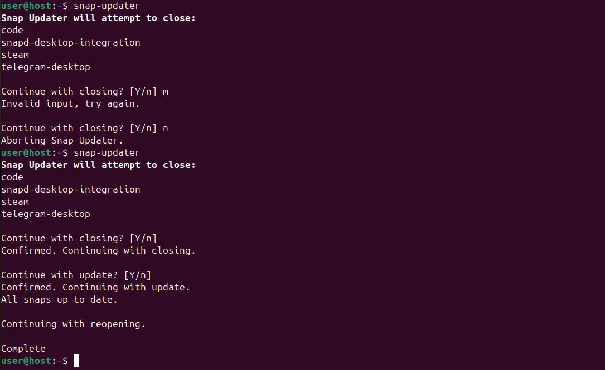

<h1 align="center">
  
  <br />
  snap-updater
</h1>

<h3 align="center">Close, update, and reopen your desktop Snaps with one command.</h3>
<div align="center"></div>
<br>
<h2 align="center">Background</h2>

Snap is a packaging format and deployment system developed by Canonical for Ubuntu and other Linux-based operating systems.
One limitation of Snap packages is that they are unable to refresh or "update" while they are running.
Snap Updater is a sh script with the goal of making updating desktop Snaps easier by working around this limitation. 

<br>
<h2 align="center">Setup</h2>

Assuming you already have Git installed...

<h3>1. Run the following to clone the repository to your Downloads directory.</h3>

```shell
git clone https://github.com/fr0gdude/snap-updater ~/Downloads/snap-updater
``` 

<h3>2. Run the following to make the script executable.</h3>

```shell
chmod +x ~/Downloads/snap-updater/snap-updater
``` 

<h3>3. Run one of the following to make a copy of snap-updater to a bin directory.</h3>

<h4>System wide:</h4>

```shell
cp ~/Downloads/snap-updater/snap-updater /usr/local/bin/snap-updater
``` 

<h4>User:</h4>

```shell
cp ~/Downloads/snap-updater/snap-updater ~/.local/bin/snap-updater
``` 

<h3>4. Run the following to delete the Git repo from your Downloads directory.</h4>

```shell
rm -fr ~/Downloads/snap-updater
``` 

<h3>5. If you made the copy to your user's bin directory, you may need to add the following to your shell config file.</h4>
<b>(e.g. </b><code>.bashrc</code> <code>.zshrc</code><b>)</b>

```shell
export PATH="$PATH:$HOME/.local/bin"
``` 

<br>
<h2 align="center">Running</h2>

Simply run <code>snap-updater</code> in the terminal emulator of your choice and follow the prompts.<br>
Entering the input "n" to either of the confirmations will cause the script to end.
